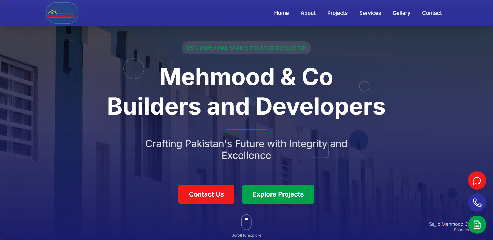

# 🏗️ Mehmood Co – Builders & Developers

A modern and responsive **Next.js** web application for Mehmood Co – Builders & Developers. Showcases construction projects, company services, gallery, and contact information—all optimized for speed and performance.

---
## 📸 preview


---


## 🌎 Live Preview

[View the live website](https://mehmood-co-builders-and-developers.vercel.app)


---

## 🌟 Features

- 🔹 **Fully Responsive** – Ultra-smooth experience on mobile, tablet, and desktop  
- 🔹 **Service Pages** – Detailed overviews of real estate and construction offerings  
- 🔹 **Gallery Section** – Visual showcase of past and ongoing projects  
- 🔹 **Contact Form** – Front-end setup prepared for backend integration  
- 🔹 **Static Data-Driven** – Uses local `data/` files—easily migratable to a CMS  
- 🔹 **Fast & Optimized** – Built on Next.js for performant SSR and SSG  

---

## 🛠️ Tech Stack

- **Next.js** – React framework with App Router  
- **TypeScript** – Strong typing for reliable code  
- **CSS** – Scoped styles and layout  
- **Vercel** – One-click deployment platform  

---

## 🚀 Getting Started

```bash
# 1. Clone the repo
git clone https://github.com/Shafiullah717/mehmood-co-Builders-and-Developers.git
cd mehmood-co-Builders-and-Developers

# 2. Install dependencies
npm install
# or using Yarn / PNPM:
# yarn install
# pnpm install

# 3. Run the development server
npm run dev
```

Navigate to `http://localhost:3000` in your browser to view the project.

---

## 📂 Project Structure

```
app/                # Next.js App Router pages and layouts
components/         # Reusable UI elements (Navbar, Footer, etc.)
data/               # Content files for services, projects, gallery
public/             # Static assets like images and icons
styles/             # Global and component-level styles
next.config.ts      # Project configuration
package.json        # Project scripts and dependencies
tsconfig.json       # TypeScript configuration
README.md           # This file
```

---

## 🚢 Deployment

This project is optimized for deployment on **Vercel**:

1. Push the repo to GitHub.
2. Create a new project on Vercel and link the GitHub repository.
3. Set any required environment variables (if needed).
4. Deploy with automatic CI/CD.

Alternative hosting platforms: Netlify, Render, or other Node.js–compatible services.

---

## 🎯 Contributing

Contributions are welcome! Let’s build better together:

1. Fork this repository  
2. Create a new branch: `git checkout -b feat/your-feature`  
3. Commit with clear and descriptive messages  
4. Submit a Pull Request with details of your changes

---

## 📬 Contact

Have suggestions or questions? Reach out:

- GitHub: [Shafiullah717](https://github.com/Shafiullah717)  
- LinkedIn: [Shafi Ullah](https://www.linkedin.com/in/shafi-ullah-086b83284/)  

---

⭐ If you find this project useful or interesting, please **star** it on GitHub!
